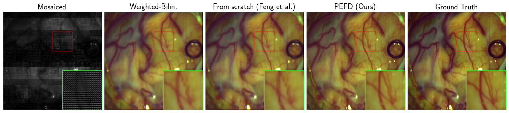

# Code for "Perspective-Equivariant Fine-tuning for Multispectral Demosaicing without Ground Truth"

> A. Wang, M. Davies, “Perspective-Equivariant Fine-tuning for Multispectral Demosaicing without Ground Truth”, to appear in the Proceedings of the IEEE/CVF Conference on Computer Vision and Pattern Recognition (CVPR) Workshops, 2026.

**Abstract**: Multispectral demosaicing is crucial to reconstruct full-resolution spectral images from snapshot mosaiced measurements, enabling real-time imaging from neurosurgery to autonomous driving. Classical methods are blurry, while supervised learning requires costly ground truth (GT) obtained from slow line-scanning systems. We propose Perspective-Equivariant Fine-tuning for Demosaicing (PEFD), a framework that learns multispectral demosaicing from mosaiced measurements alone. PEFD a) exploits the projective geometry of camera-based imaging systems to leverage a richer group structure than previous demosaicing methods to recover more null-space information, and b) learns efficiently without GT by adapting pretrained foundation models designed for 1-3 channel imaging. On intraoperative and automotive datasets, PEFD recovers fine details such as blood vessels and preserves spectral fidelity, substantially outperforming recent approaches, nearing supervised performance.

## Usage

1. Install [DeepInverse](https://deepinv.github.io/deepinv/): `pip install deepinv`
2. Clone this repository and change into the directory.
3. Prepare paths for your dataset, model and results directory. See comments in `tune.py` for instructions.
4. Call `python tune.py --dataset <DATASET PATH> --model_pth <MODEL PATH> --out <RESULTS DIRECTORY>`